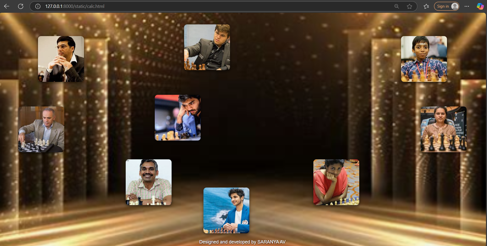

# Ex.08 Design of Interactive Image Gallery
## Date:07-05-2025

## AIM:
To design a web application for an inteactive image gallery with minimum five images.

## DESIGN STEPS:

### Step 1:
Clone the github repository and create Django admin interface.

### Step 2:
Change settings.py file to allow request from all hosts.

### Step 3:
Use CSS for positioning and styling.

### Step 4:
Write JavaScript program for implementing interactivity.

### Step 5:
Validate the HTML and CSS code.

### Step 6:
Publish the website in the given URL.

## PROGRAM :
```
<!DOCTYPE html>
<html lang="en">
<head>
  <meta charset="UTF-8" />
  <meta name="viewport" content="width=device-width, initial-scale=1.0"/>
  <title>Chess Gallery</title>
  <style>
    body {
      margin: 0;
      font-family: Arial, sans-serif;
      background: url('./background.png') no-repeat center center fixed;
      background-size: cover;
      height: 100vh;
      overflow: hidden;
      position: relative;
    }
.gallery-container {
      position: relative;
      width: 100%;
      height: 100vh;
    }
.gallery-item {
      position: absolute;
      width: 180px;
      height: 180px;
      border-radius: 12px;
      overflow: hidden;
      box-shadow: 0 4px 12px rgba(0, 0, 0, 0.6);
      cursor: pointer;
      transition: transform 0.3s;
    }
.gallery-item img {
      width: 100%;
      height: 100%;
      object-fit: cover;
    }
.gallery-item:hover {
      transform: scale(1.1);
    }
/* Adjusted positions for larger size */
    .item1 { top: 10%; left: 8%; }
    .item2 { top: 5%; left: 38%; }
    .item3 { top: 10%; right: 8%; }
    .item4 { top: 40%; left: 4%; }
    .item5 { top: 35%; left: 32%; }
    .item6 { top: 40%; right: 4%; }
    .item7 { bottom: 18%; left: 26%; }
    .item8 { bottom: 18%; right: 26%; }
    .item9 { bottom: 6%; left: 42%; }
.lightbox {
      position: fixed;
      top: 0; left: 0;
      width: 100%; height: 100%;
      background: rgba(0, 0, 0, 0.8);
      display: none;
      align-items: center;
      justify-content: center;
      z-index: 1000;
    }
.lightbox img {
      max-width: 90%;
      max-height: 90%;
      border-radius: 12px;
    }
     .close {
      position: absolute;
      top: 20px;
      right: 30px;
      font-size: 30px;
      color: white;
      cursor: pointer;
    }
 .footer {
      position: absolute;
      bottom: 10px;
      width: 100%;
      text-align: center;
      color: rgb(255, 255, 255);
      font-size: 18px;
      text-shadow: 1px 1px 3px black;
    }
  </style>
</head>
<body>

<div class="gallery-container">
<div class="gallery-item item1"></div>
    <div class="gallery-item item2"></div>
    <div class="gallery-item item3"></div>
    <div class="gallery-item item4"></div>
    <div class="gallery-item item5"></div>
    <div class="gallery-item item6"></div>
    <div class="gallery-item item7"></div>
    <div class="gallery-item item8"></div>
    <div class="gallery-item item9"></div>
  </div>

  </div>

  <div class="lightbox">
    <span class="close">&times;</span>
    
  </div>

  <div class="footer">Designed and developed by SARANYA  AV</div>

  <script>
    document.addEventListener('DOMContentLoaded', () => {
      const items = document.querySelectorAll('.gallery-item img');
      const lightbox = document.querySelector('.lightbox');
      const lightboxImage = document.querySelector('.lightbox img');
      const closeBtn = document.querySelector('.close');

      items.forEach(img => {
        img.addEventListener('click', () => {
          lightbox.style.display = 'flex';
          lightboxImage.src = img.src;
        });
      });

      closeBtn.addEventListener('click', () => {
        lightbox.style.display = 'none';
        lightboxImage.src = '';
      });

      lightbox.addEventListener('click', (e) => {
        if (e.target !== lightboxImage) {
          lightbox.style.display = 'none';
          lightboxImage.src = '';
        }
      });
    });
  </script>

</body>
</html>
```


## OUTPUT:




## RESULT:
The program for designing an interactive image gallery using HTML, CSS and JavaScript is executed successfully.
